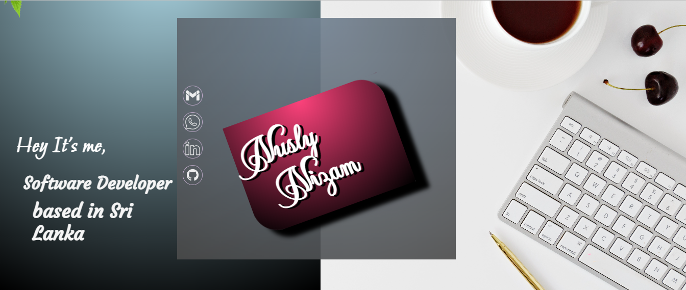

<h1 align="center">Hi 👋, I'm Nusly Nizam</h1>

<h3 align="center">A passionate Software developer from Sri Lanka</h3>

<h3 align="center"></h3>

I am a full-time geek, always keen to work on automating processes and building utility applications for easing out monotonous daily works

  

  

  

- 🔭 I’m Followed BSc Degree at **Sri Lankan Institue Information Technology**

- 🌱 I’m Followed **Computer Science and Software Engineering**

- 👨‍🎓 My primary coding language **Java**

- 👨‍💻 All of my projects are available at [https://github.com/nuzynuz](https://github.com/nuzynuz)

- 📝 You can know about me [https://nuslynizam.github.io/MyProfile/](https://nuslynizam.github.io/MyProfile/)

- 💬 Ask me about everything **+94774684694**

- 📫 How to reach me **nusly.nizam@gmail.com**

<h3 align="center"> 📞 Connect with me: 📞</h3>

<h3 align="center"> 📗 Languages and Frameworks I use : 📗</h3>
<h3 align="center">Main Languages :</h3>

 <a href="https://www.java.com" target="_blank" rel="noreferrer"> <kbd>  </a> <a href="https://www.w3.org/html/" target="_blank" rel="noreferrer"></kbd>  </a>     

  
<h3 align="center">FrontEnd :</h3>

   

 
<h3 align="center">BackEnd :</h3>

     

<h3 align="center">DataBase :</h3>

    

<h3 align="center"> 📌 Tools I use : 📌</h3>

 <a href="https://www.w3schools.com/css/" target="_blank" rel="noreferrer">     

<h3 align="center"> ⭐ My Github Stats ⭐</h3>

<h3 align="center">Thank you so much ❤️ coming to my 👉 Github profile 👈  Have a nice day ! 👋</h3>
